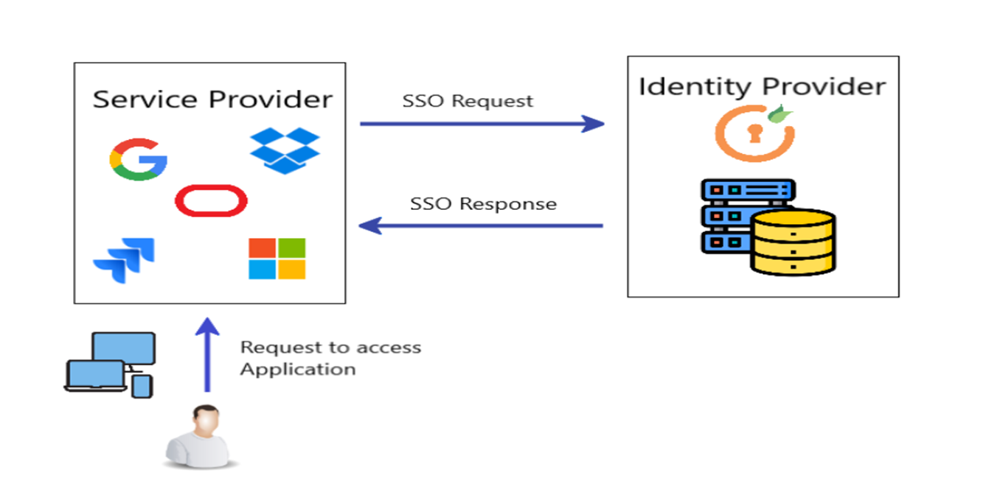

# TSO Spring Boot, SAML, and Okta Web Application

This is TSO SAML Web application that demonstrates how to implement single sign-on (SSO) with Spring Security's SAML and IdP Okta.

**Prerequisites:** 

- [SDKMAN](https://sdkman.io/) (for Java 17)
- Java 21 LTS - path
- IntelliJ Education Edition (Community Edition) along with plug-ins for maven, gradel, GIT, SonarLint
- Maven3 - path
- Gradle
- SourceTree (GIT Flows)
- MobaXTerm - openssl for creating local certs (cygwin)
- MongoDBServer & Client (Datastore)
- Thymeleaf(th)

> [Okta](https://developer.okta.com/) has Authentication and User Management APIs that reduce development time with instant-on, scalable user infrastructure. Okta's intuitive API and expert support make it easy for developers to authenticate, manage and secure users and roles in any application.

* [Getting Started](#getting-started)
* [Links](#links)
* [Help](#help)
* [License](#license)

## Getting Started

To install this example application, run the following commands:

```bash
git clone https://github.com/bandapally/tso-saml-app.git
cd tso-saml-app
```

### Create a TSO SAML App in Okta



To begin, you'll need an Okta developer account. You can create one at [developer.okta.com/signup](https://developer.okta.com/signup) or install the [Okta CLI](https://cli.okta.com) and run `okta register`.

Then, log in to your account and go to **Applications** > **Create App Integration**. Select **SAML 2.0** and click **Next**. Name your app something like `Spring Boot SAML` and click **Next**.

Use the following settings:

* Single sign on URL: `http://localhost:8080/login/saml2/sso/okta`
* Use this for Recipient URL and Destination URL: ✅ (the default)
* Audience URI: `http://localhost:8080/saml2/service-provider-metadata/okta`

Then click **Next**. Select the following options:

* I'm an Okta customer adding an internal app
* This is an internal app that we have created

Select **Finish**.

Okta will create your app, and you will be redirected to its **Sign On** tab. Scroll down to the **SAML Signing Certificates** and go to **SHA-2** > **Actions** > **View IdP Metadata**. You can right-click and copy this menu item's link or open its URL. Copy the resulting link to your clipboard. It should look something like the following:

```
https://dev-13337.okta.com/app/<random-characters>/sso/saml/metadata
```

## License

Apache 2.0, see [LICENSE](LICENSE).
